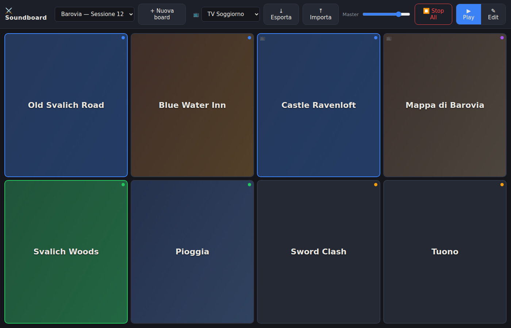
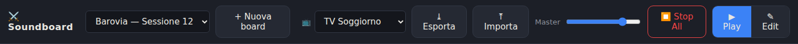
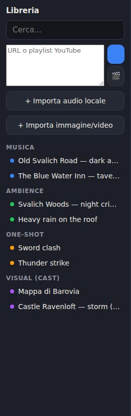
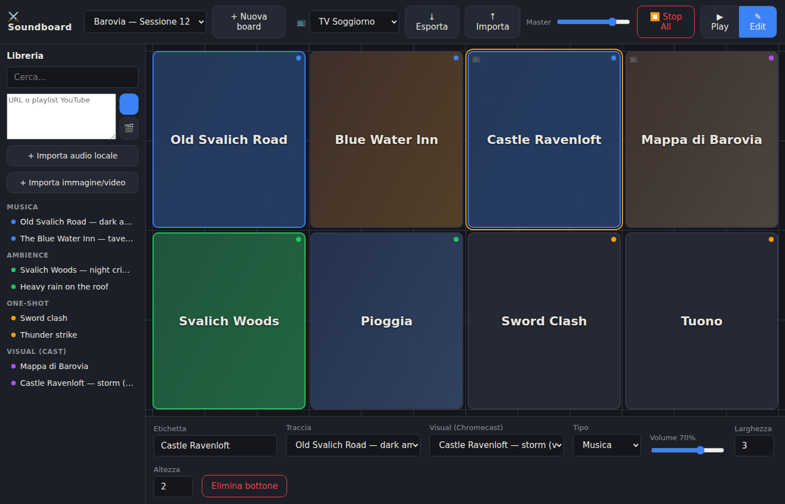
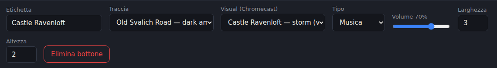

# ⚔️ DnD Soundboard

A local-first soundboard **and scene board** for tabletop RPG sessions. Lay out
music, ambience, one-shot effects **and visuals** on a grid of buttons, pull
tracks straight from YouTube, and fire them during play: audio out of your PC or
Bluetooth speaker, images and videos cast to the Chromecast on your TV.
**Electron + Vue 3 + Pinia + Web Audio API + Google Cast.**

Run it three ways from the same codebase:

- **Desktop app** — Windows / Ubuntu / macOS (Electron).
- **Tablet mode** — a small LAN server you host (e.g. a Proxmox LXC); open it in
  a tablet's browser and play out the tablet's own Bluetooth speaker. See
  [Tablet mode](#-tablet-mode-lan-server).
- **Chromecast** — either mode can cast images/videos to a TV on the same LAN.



---

## Contents

- [Features](#features)
- [Installation](#-installation)
- [Quick start (development)](#-quick-start-development)
- [Using the app](#-using-the-app)
  - [The toolbar](#the-toolbar)
  - [Boards](#boards)
  - [Building your library](#building-your-library)
  - [Edit mode](#edit-mode)
  - [Play mode](#play-mode)
  - [Visuals & Chromecast](#visuals--chromecast)
  - [Scenes](#scenes)
  - [Export / Import](#export--import)
- [Tablet mode (LAN server)](#-tablet-mode-lan-server)
- [Data & storage](#-data--storage)
- [Development](#-development)
- [Releases (CI)](#-releases-ci)
- [Troubleshooting](#-troubleshooting)

---

## Features

- **Grid boards** — resizable buttons on a grid, multiple boards, switch from the toolbar.
- **Three audio channels** — *music* (exclusive, with crossfade/fade/instant
  transitions), *ambience* (layered, looping), *one-shot* (fire-and-forget effects).
- **Long tracks stream** — 1–2 h loops play via streaming + HTTP range requests:
  instant start, no gigabytes of decoded audio in RAM, no stutter.
- **YouTube import** — paste a single link, **many links at once, or a whole playlist**;
  downloads run **in parallel**. Audio is extracted to mp3 with thumbnails.
- **YouTube video import** — the same box downloads the *video* as a
  Chromecast-safe H.264 mp4 (🎬 button).
- **Local import** — your own mp3/ogg/wav/m4a/flac, plus jpg/png/webp/gif images
  and mp4/webm videos as visuals.
- **Chromecast visuals** — cast any image or video to your TV. The app serves
  the file over HTTP on your LAN and drives the TV with the Cast protocol —
  no browser-tab casting, no mirroring, no flakiness.
- **Scenes** — one button = a track **and** a visual: tap it and the tavern
  theme starts on your speaker while the tavern picture appears on the TV.
- **Export / Import** — share boards + settings + library metadata as one JSON
  (no heavy media; YouTube tracks re-download themselves on the other machine).
- **Self-healing** — if a referenced audio/visual file is missing, it's
  re-downloaded automatically from its YouTube source on board open.
- **Local-first** — everything lives in plain JSON + local files; no account, no cloud.

---

## 📦 Installation

Grab the latest build from the **[Releases page](../../releases)** (built
automatically by CI — see [Releases](#-releases-ci)):

| Platform | File | Notes |
|---|---|---|
| Windows | `dnd-soundboard-Setup-<version>.exe` | NSIS installer (choose install dir) |
| Windows (portable) | `dnd-soundboard-<version>-win.zip` | unzip anywhere, run `dnd-soundboard.exe` |
| Ubuntu / Debian | `dnd-soundboard_<version>_amd64.deb` | `sudo apt install ./dnd-soundboard_*.deb` — pulls the required system libraries |
| Other Linux | `dnd-soundboard-<version>.AppImage` | `chmod +x` and run; needs `libfuse2` on Ubuntu 22.04+ |

All packages bundle `yt-dlp` and a static `ffmpeg` — nothing else to install.

---

## 🚀 Quick start (development)

### Requirements

- **Node.js 20+**
- **`yt-dlp`** — in your `PATH` or in `./bin` (`yt-dlp.exe` on Windows).
  `./install.sh` / `npm run fetch:ytdlp` fetches the latest release into `./bin`.
- **`ffmpeg`** — in your `PATH` or in `./bin` (`npm run fetch:ffmpeg` /
  `fetch:ffmpeg:win` downloads a static build; packaged builds bundle it).
- **Linux only**: Electron needs a few system libraries that minimal
  Debian/Ubuntu/WSL installs lack. `./install.sh` detects and installs them, or run:

  ```bash
  sudo apt-get install -y libnss3 libnspr4 libasound2t64   # libasound2 before Ubuntu 24.04
  ```

### Run in development

```bash
./install.sh      # npm install + yt-dlp + system-library check
npm run dev        # launches Vite + Electron with hot reload
```

### Build a distributable locally

| Platform | Command | Output |
|---|---|---|
| Windows (on Windows) | `npm run build` | NSIS installer + portable zip |
| Windows (from Linux/WSL, no wine) | `npm run build:win:zip` | portable zip |
| Ubuntu / Linux | `npm run build:linux` | `.deb` + AppImage |
| macOS | `npm run build:mac` | default target |

Output lands in `dist/out/`.

---

## 🎛️ Using the app

### The toolbar



Left to right: **board switcher**, **+ Nuova board**, the **📺 Chromecast
picker**, **Export/Import**, the **Master volume**, **⏹ Stop All** (fades all
audio out *and* stops the cast) and the **Play/Edit** mode toggle.

### Boards

- **+ Nuova board** creates a board; the dropdown switches between them.
- A board is a grid (default 8×12) of buttons. Each button points at a library
  track and/or visual by id — so boards stay tiny and portable.

### Building your library

In **Edit mode** the left sidebar is your library.



- **YouTube** — paste into the *"URL o playlist YouTube"* box. You can paste:
  - a single video URL,
  - **several URLs** (one per line / separated by spaces or commas),
  - a **playlist** URL — it's expanded into its videos automatically.

  Then hit:
  - the **⬇ button** to download the **audio** (mp3 + thumbnail), or
  - the **🎬 button** to download the **video** (H.264 mp4, max 1080p — the
    profile every Chromecast can play).

  Downloads run **up to 3 at a time**, each with its own progress bar; finished
  ones drop off the list, failures stay so you can retry.
- **+ Importa audio locale** — add your own audio files as one-shots.
- **+ Importa immagine/video** — add images/videos as visuals for the cast.
- Tracks are grouped **Musica / Ambience / One-Shot / Visual (cast)**. The
  coloured dot marks the channel (blue/green/amber/purple). Drag anything onto
  the grid to create a button.

> Set the download bitrate with the `SOUNDBOARD_AUDIO_QUALITY` env var
> (e.g. `7` ≈ 96 kbps) to shrink long ambience loops.

### Edit mode



- **Drag** a library track or visual onto the grid to add a button; **drag** an
  existing button to move it.
- **Click** a button to select it (orange outline) and edit it in the
  **properties panel**: label, audio track, visual, channel, volume, size.



- A button showing a dashed border is **unassigned** or its file is **missing**.

### Play mode

The session view — big buttons, no editing. Tap to trigger. Button colours:

| Colour | Meaning |
|---|---|
| 🔵 Blue border | Music track currently playing (one at a time) |
| 🟢 Green border | Ambience layer currently playing |
| 🟠 Amber flash | One-shot just fired |
| 🟣 Purple border | Visual currently on the TV |
| 📺 badge | The button has a visual attached (lights up while casting) |
| Dashed / faded | File missing or nothing assigned |

### Visuals & Chromecast

1. Pick your TV from the **📺 dropdown** in the toolbar. Devices are discovered
   automatically (mDNS); if your network blocks discovery, choose *"IP
   manuale…"* and type the Chromecast's IP.
2. Tap any button with a visual: the image/video appears on the TV. Videos
   **loop automatically**; images stay up.
3. Tap the button again — or the **✕** next to the picker, or **Stop All** —
   to stop casting. Casting a different visual simply replaces the current one.

**How it works** — the app never "casts a tab": the Node process (desktop app
or LAN server) tells the Chromecast to fetch the file from a tiny local HTTP
media endpoint (`:8123` on desktop, the server port in tablet mode). That's the
reliable way to cast and costs nothing in quality. The PC/server and the TV
must be on the same LAN.

### Scenes

A scene is just a button with **both** fields set in the properties panel:

- **Traccia** → the audio that plays locally (Bluetooth speaker = your OS
  default output device);
- **Visual (Chromecast)** → the image/video that goes to the TV.

Tap once: *"enter the tavern"* — tavern song on the speaker, tavern interior on
the TV. Tap again to toggle off. Dragging a visual onto the grid creates the
button ready to receive a track.

### Export / Import

- **⤓ Esporta** writes a single JSON with your settings, all boards, and the
  library index (track metadata + YouTube URLs) — **without** the media files.
- **⤒ Importa** loads such a file on another machine: boards and settings appear
  immediately, and the YouTube tracks/videos re-download themselves automatically.
- Locally-imported (non-YouTube) files can't be re-fetched, so they'll show as
  missing after import on a fresh machine.

---

## 📱 Tablet mode (LAN server)

Want to drive the soundboard from a tablet and play out its Bluetooth speaker?
Host the server (downloads still happen server-side where yt-dlp works) and open
it in the tablet's browser — it runs the same UI, plays audio locally **and can
cast to the Chromecast** (the cast session runs on the server).

**On a Proxmox LXC (Debian/Ubuntu), as root:**

```bash
apt-get update && apt-get install -y curl
REPO_URL=https://github.com/mp97dev/dnd-soundboard.git BRANCH=main \
  bash <(curl -fsSL https://raw.githubusercontent.com/mp97dev/dnd-soundboard/main/scripts/deploy-lxc.sh)
```

This installs Node + ffmpeg + yt-dlp, builds the renderer, and sets up two
systemd units: the **server** and a **15-minute auto-updater** that pulls new
commits and rebuilds. Then open `http://<lxc-ip>:8080` on the tablet.

Run it locally instead with `npm run server` (→ `http://localhost:8080`).

Full details, env vars, cast API, egress/caching notes and remote access
(Tailscale) are in **[server/README.md](server/README.md)**.

---

## 💾 Data & storage

Everything is plain JSON + local files. In desktop dev it's `./data`; in a
packaged app it's the OS `userData` folder; on the server it's
`SOUNDBOARD_DATA_DIR` (kept outside the repo).

```
data/
├── boards/*.json        Boards (grid + buttons: trackId / visualId)
├── library/
│   ├── index.json       Track & visual index
│   ├── builtin/         Bundled sounds (ambience/, oneshots/)
│   ├── downloaded/      Media (YouTube + local imports: mp3, mp4, images)
│   └── thumbnails/
└── settings.json        incl. the selected Chromecast
```

The renderer never touches the filesystem directly: in the desktop app it reads
assets through the custom `media://` protocol and talks to the main process over
IPC; in the browser/server build the same calls go over HTTP + WebSocket. The
Chromecast fetches media over plain HTTP with range support.

### Built-in sounds

Put audio in `data/library/builtin/ambience/` and `oneshots/`, then add entries
to `data/library/index.json` (or just import them from the app as local files).

---

## 🛠️ Development

```
electron/            Main process (desktop)
├── main.js          Window, media:// protocol, bootstrap
├── preload.js       Secure IPC bridge (window.api)
├── paths.js         Local data paths
└── ipc/             boards/library, settings, ytdlp, config, cast
                     (cast.js also runs the :8123 LAN media endpoint)

src/                 Renderer (Vue 3) — shared by desktop and server
├── audio/engine.js  Web Audio: music (transitions), ambience, one-shots
├── media.js         media:// (Electron) vs /media/ (web) URL base
├── stores/          Pinia: library, boards, settings, playback (incl. cast)
└── components/      PlayMode, EditMode, LibrarySidebar, PropertiesPanel, SoundButton

server/              LAN server (tablet mode): HTTP + WS over the same renderer
└── lib/             store, ytdlp, paths + shared modules:
    ├── media.js     Range-aware media serving (used by server AND electron)
    └── cast.js      Chromecast discovery (mDNS) + control (castv2)

scripts/             yt-dlp/ffmpeg fetch, LXC deploy, screenshots, systemd units
e2e/                 Playwright tests (Electron)
```

Run the end-to-end tests / regenerate the README screenshots:

```bash
npm run test:e2e
node scripts/screenshots.cjs   # self-contained demo dataset, no downloads
```

---

## 🤖 Releases (CI)

Pushing a tag `v*` triggers the **release workflow**
([.github/workflows/release.yml](.github/workflows/release.yml)):

1. builds Windows (NSIS installer + portable zip) on a Windows runner;
2. builds Linux (`.deb` + AppImage) on an Ubuntu runner;
3. publishes a GitHub Release named after the tag, with the **commit history
   since the previous tag as changelog** and all artifacts attached.

To cut a release:

```bash
npm version 0.2.0          # bumps package.json + creates tag v0.2.0
git push --follow-tags
```

You can also run the workflow manually (workflow_dispatch) to get build
artifacts without publishing a release.

---

## 🩺 Troubleshooting

- **App doesn't start on Linux** (nothing happens / `libnspr4.so` error):
  install the system libraries — `sudo apt-get install -y libnss3 libnspr4
  libasound2t64` (or use the `.deb`, which declares them as dependencies).
- **YouTube download fails** (e.g. *"Precondition check failed"*): yt-dlp is out
  of date — re-run `./install.sh` or `npm run fetch:ytdlp`.
- **No audio on a track / "file missing"**: the file wasn't found; open the board
  (YouTube media re-download) or click *"Scarica N file mancanti"* in the sidebar.
- **`ffmpeg not found`**: `npm run fetch:ffmpeg`, or install it on the `PATH`.
- **No Chromecast in the 📺 list**: discovery needs mDNS multicast on the same
  LAN — VLANs, guest Wi-Fi and WSL block it. Use *"IP manuale…"* with the TV's
  IP (visible in the Google Home app). The cast itself only needs the TV to
  reach the PC/server on port 8123 (desktop) or the server port.
- **Cast starts then stops** on old Chromecast models: make sure the video is
  H.264 mp4 (the 🎬 download already is; re-encode exotic local files).
- **Tablet can't reach the server**: it must be on the same network as the host;
  check the LXC IP and that port `8080` is open. See
  [server/README.md](server/README.md) for remote access.
