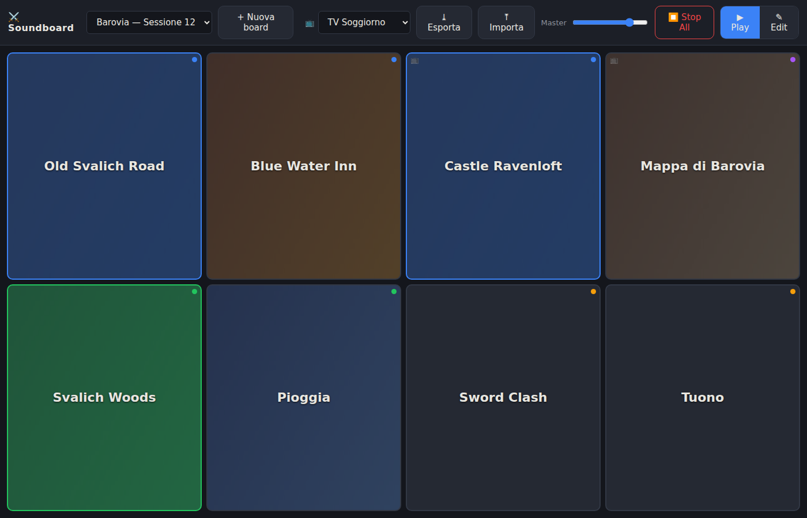
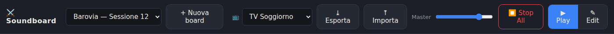
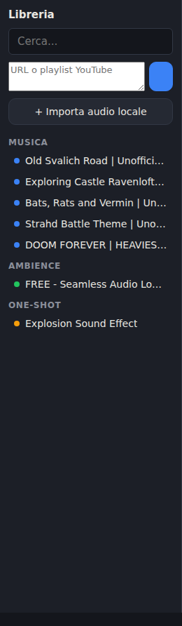
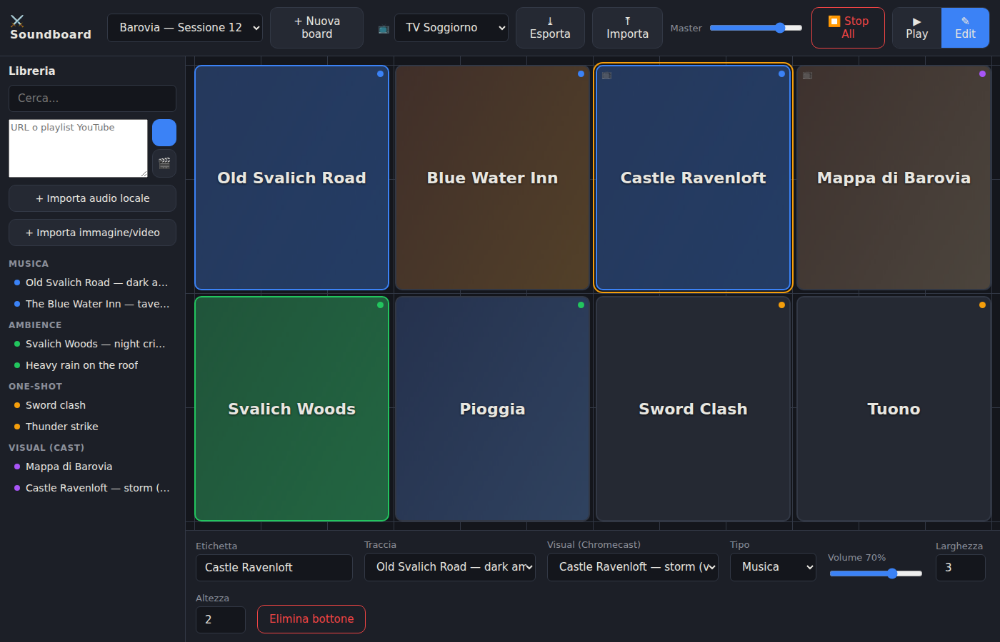
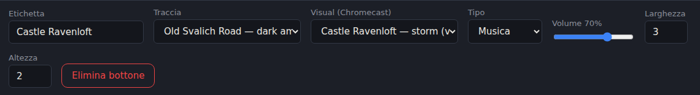

# ⚔️ DnD Soundboard

A local-first soundboard **and scene board** for tabletop RPG sessions. Lay out
music, ambience, one-shot effects **and visuals** on a grid of buttons, pull
tracks straight from YouTube, and fire them during play: audio out of your PC or
Bluetooth speaker, images and videos cast to the Chromecast on your TV.
**Electron + Vue 3 + Pinia + Web Audio API + Google Cast.**

Run it three ways from the same codebase:

- **Desktop app** — Windows / Ubuntu / macOS (Electron).
- **Tablet mode** — a small LAN server you host (e.g. a Proxmox LXC); open it in
  a tablet's browser and play out the tablet's own Bluetooth speaker. See
  [Tablet mode](#-tablet-mode-lan-server).
- **Chromecast** — either mode can cast images/videos to a TV on the same LAN.



---

## Contents

- [Features](#features)
- [Installation](#-installation)
- [Quick start (development)](#-quick-start-development)
- [Using the app](#-using-the-app)
  - [The toolbar](#the-toolbar)
  - [Boards](#boards)
  - [Building your library](#building-your-library)
  - [Edit mode](#edit-mode)
  - [Play mode](#play-mode)
  - [Visuals & Chromecast](#visuals--chromecast)
  - [Scenes](#scenes)
  - [Export / Import](#export--import)
- [Tablet mode (LAN server)](#-tablet-mode-lan-server)
  - [Viewer full-screen on a tablet](#putting-the-viewer-full-screen-on-a-tablet)
- [Data & storage](#-data--storage)
- [Development](#-development)
- [Releases (CI)](#-releases-ci)
- [Troubleshooting](#-troubleshooting)
- [Findings & test plan](docs/session-test-plan.md) — why audio stuttered and the
  TV dropped during a real 4-hour session, what changed, and what to measure next
- [Known limitations & workarounds](docs/known-limitations.md) — what's
  deliberately unfinished, the tab-casting fallback, and the technical debt
  behind each decision

---

## Features

- **Grid boards** — resizable buttons on a grid, multiple boards, switch from the toolbar.
- **Three audio channels** — *music* (exclusive, with crossfade/fade/instant
  transitions), *ambience* (layered, looping), *one-shot* (fire-and-forget effects).
- **Long tracks stream** — 1–2 h loops play via streaming + HTTP range requests:
  instant start, no gigabytes of decoded audio in RAM, no stutter.
- **YouTube import** — paste a single link, **many links at once, or a whole playlist**;
  downloads run **in parallel**. Audio is extracted to mp3 with thumbnails.
- **YouTube video import** — the same box downloads the *video* as a
  Chromecast-safe H.264 mp4 (🎬 button).
- **Local import** — your own mp3/ogg/wav/m4a/flac, plus jpg/png/webp/gif images
  and mp4/webm videos as visuals.
- **Searchable, taggable library** — filter by name *or* tag, tag tracks by usage
  (combat, exploration) and biome (city, castle, forest…), rename anything
  inline, preview audio without leaving edit mode.
- **Folders that don't force a choice** — file tracks per campaign, and put the
  same track in *several* folders at once: the battle theme you reuse in a new
  campaign genuinely lives in both, with no copies on disk.
- **Full-window library** — a dialog with a cover-art grid for finding things
  mid-session and a multi-select table for tidying up between them: bulk tag,
  bulk file, bulk retype, bulk remove.
- **Themes, including your own** — three built-in (warm dark, indigo dark, and a
  light one for prep in daylight) plus a custom palette you build yourself.
- **Italian and English** — follows the system language on first run, and never
  translates the tags you typed.
- **Chromecast visuals** — cast any image or video to your TV. The app serves
  the file over HTTP on your LAN and drives the TV with the Cast protocol, so
  the TV decodes the original file instead of a re-encoded mirror of a browser
  tab. (If casting misbehaves on your network there's a tab-casting fallback —
  see [known limitations](docs/known-limitations.md).)
- **Viewer page** — the current visual is also served as a plain web page on your
  LAN: open it on a tablet or any second screen, with or without a Chromecast.
- **Diagnostic log** — a single rotating log file records playback, cast session
  health and the audio/network environment, so a bad session can be explained
  afterwards instead of guessed at.
- **Scenes** — one button = a track **and** a visual: tap it and the tavern
  theme starts on your speaker while the tavern picture appears on the TV.
- **Export / Import** — share boards + settings + library metadata as one JSON
  (no heavy media; YouTube tracks re-download themselves on the other machine).
- **Self-healing** — if a referenced audio/visual file is missing, it's
  re-downloaded automatically from its YouTube source on board open.
- **Local-first** — everything lives in plain JSON + local files; no account, no cloud.

---

## 📦 Installation

Grab the latest build from the **[Releases page](../../releases)** (built
automatically by CI — see [Releases](#-releases-ci)):

| Platform | File | Notes |
|---|---|---|
| Windows | `dnd-soundboard-Setup-<version>.exe` | NSIS installer (per-user, choose install dir) |
| Windows (portable) | `dnd-soundboard-<version>-win.zip` | unzip anywhere, run `DnD Soundboard.exe` |
| Ubuntu / Debian | `dnd-soundboard-<version>-amd64.deb` | `sudo apt install ./dnd-soundboard-*.deb` — pulls the required system libraries |
| Other Linux | `dnd-soundboard-<version>-x86_64.AppImage` | `chmod +x` and run; needs `libfuse2` on Ubuntu 22.04+ |

All packages bundle `yt-dlp` and a static `ffmpeg` — nothing else to install.

The builds are not code-signed, so Windows SmartScreen shows an "unknown
publisher" warning on first run. Every release includes a `SHA256SUMS.txt`;
verify a download with:

```bash
sha256sum -c --ignore-missing SHA256SUMS.txt
```

(on Windows: `CertUtil -hashfile dnd-soundboard-Setup-<version>.exe SHA256`
and compare.)

---

## 🚀 Quick start (development)

### Requirements

- **Node.js 20+**
- **`yt-dlp`** — in your `PATH` or in `./bin` (`yt-dlp.exe` on Windows).
  `./install.sh` / `npm run fetch:ytdlp` fetches the latest release into `./bin`.
- **`ffmpeg`** — in your `PATH` or in `./bin` (`npm run fetch:ffmpeg` /
  `fetch:ffmpeg:win` downloads a static build; packaged builds bundle it).
- **Linux only**: Electron needs a few system libraries that minimal
  Debian/Ubuntu/WSL installs lack. `./install.sh` detects and installs them, or run:

  ```bash
  sudo apt-get install -y libnss3 libnspr4 libasound2t64   # libasound2 before Ubuntu 24.04
  ```

### Run in development

```bash
./install.sh      # npm install + yt-dlp + system-library check
npm run dev        # launches Vite + Electron with hot reload
```

### Build a distributable locally

| Platform | Command | Output |
|---|---|---|
| Windows (on Windows) | `npm run build` | NSIS installer + portable zip |
| Windows (from Linux/WSL, no wine) | `npm run build:win:zip` | portable zip |
| Ubuntu / Linux | `npm run build:linux` | `.deb` + AppImage |
| macOS | `npm run build:mac` | default target |

Output lands in `dist/out/`.

---

## 🎛️ Using the app

### The toolbar



Left to right: **board switcher**, **+ Nuova board**, the **📺 Chromecast
picker**, the **📱 viewer link**, the **🎨 appearance & language** popover,
**Export/Import**, the **Master volume**, **⏹ Stop All** (fades all audio out
*and* stops the cast) and the **Play/Edit** mode toggle.

The bar wraps to a second row on narrower windows rather than clipping
controls — Stop All and Play/Edit never shrink, because those are the two you
reach for when something goes wrong mid-session.

**Themes and language** live in the 🎨 popover. Three built-in themes —
*Candela* (warm dark), *Notturno* (indigo dark) and *Giorno* (light, for
prep in daylight) — plus **Personale**, where you pick seven colours and the
structural tones are derived from your background and text so the result stays
legible whatever you choose. The interface is available in **Italian and
English**; on first run it follows the system language and never overrides a
choice you have made. Your own tags are data, not interface, and are never
translated.

### Boards

- **+ Nuova board** creates a board; the dropdown switches between them.
- A board is a grid (default 8×12) of buttons. Each button points at a library
  track and/or visual by id — so boards stay tiny and portable.

### Building your library

In **Edit mode** the left sidebar is your library.



- **YouTube** — paste into the *"URL o playlist YouTube"* box. You can paste:
  - a single video URL,
  - **several URLs** (one per line / separated by spaces or commas),
  - a **playlist** URL — it's expanded into its videos automatically.

  Then hit:
  - the **⬇ button** to download the **audio** (mp3 + thumbnail), or
  - the **🎬 button** to download the **video** (H.264 mp4, max 1080p — the
    profile every Chromecast can play).

  Downloads run **up to 3 at a time**, each with its own progress bar; finished
  ones drop off the list, failures stay so you can retry.
- **+ Importa audio locale** — add your own audio files as one-shots.
- **+ Importa immagine/video** — add images/videos as visuals for the cast.
- Tracks are grouped **Musica / Ambience / One-Shot / Visual (cast)**. The
  coloured dot marks the channel (blue/green/amber/purple). Drag anything onto
  the grid to create a button.

**Folders**

Above the type sections is a folder tree — make one per campaign, nest them as
deep as you like. A track can be in **more than one folder at a time**: drag it
onto a folder to *add* it there, without taking it out of where it already is.
That's the point of the model — the ambush music you reuse in a new campaign
belongs to both, and neither copy is the "real" one.

- Selecting a folder shows everything beneath it, sub-folders included.
- **Senza cartella** is just the complement, not a special place.
- Deleting a folder never deletes tracks: its children move up to its parent and
  the tracks simply stop being filed there.
- Folders travel in the `.dnds` export, so the split survives moving machines.

**The full-window library**

The button in the library header opens the whole library in a dialog, which is
easier to search than a 200px sidebar mid-session. Two views over the same
filters and the same selection:

- **⊞ Griglia** — big cover art, for finding something by eye while playing.
- **▤ Tabella** — sortable columns and checkboxes, for tidying up between
  sessions. Select rows (shift-click for a range) and apply in bulk: add or
  remove a tag, add or remove a folder, change the channel, or remove from the
  library.

Removing a track takes the entry out of the library and **leaves your files
alone** — a downloaded mp3 isn't recoverable, and "remove from library" isn't
"delete my files". Before removing, the confirmation tells you how many buttons
across **all** boards point at what you're about to remove.

**Finding things once the library grows**

- **Search** matches both the title and the tags.
- **Tags** — click ✎ on a track to rename it and edit its tags. Type a tag and
  press <kbd>Enter</kbd> (or comma) to add it; a starter set is suggested
  (*combattimento, esplorazione, taverna, castello, foresta…*) and every tag you
  have already used is autocompleted.
- **Tag filter** — the chips under the search box filter the library. Several
  active chips combine with **AND**, so *castello* + *tensione* narrows to
  exactly the tracks carrying both.
- **▶ / ■ preview** — audition a track straight from the sidebar, without placing
  it on the grid. Only one preview plays at a time.
- **Resize the sidebar** by dragging its right edge, and cycle the thumbnail size
  with 🔍. Both are remembered between sessions.

> Set the download bitrate with the `SOUNDBOARD_AUDIO_QUALITY` env var
> (e.g. `7` ≈ 96 kbps) to shrink long ambience loops.

### Edit mode



- **Drag** a library track or visual onto the grid to add a button; **drag** an
  existing button to move it. A ghost snaps to the cells the button will land
  on, and turns **red when the target is occupied** — dropping there is refused
  rather than stacking two buttons on the same cells.
- **Click** a button to select it and edit it in the **properties panel**:
  label, audio track, visual, channel, volume, size.



- **Resize by dragging any of the eight handles** on the selected button. The
  side handles move one edge, the corners move two. The **north and west
  handles move the anchor**, so a button grows left and upward — the numeric
  Larghezza/Altezza fields keep the top-left corner pinned and can only ever
  grow right and down.
- **Keyboard**: arrows nudge the selected button by a cell, `Shift`+arrows
  resize it, `Ctrl+Z` undoes and `Ctrl+Shift+Z` redoes. Undo covers the last 50
  changes, is scoped to the board you are on, and treats a whole label edit as
  one step rather than one per keystroke.
- **Double-click** a button to play it right there — handy for checking a scene
  without leaving edit mode and coming back.
- A button showing a dashed border is **unassigned** or its file is **missing**.

### Play mode

The session view — big buttons, no editing. Tap to trigger. Button colours:

| Colour | Meaning |
|---|---|
| 🔵 Blue border | Music track currently playing (one at a time) |
| 🟢 Green border | Ambience layer currently playing |
| 🟠 Amber flash | One-shot just fired |
| 🟣 Purple border | Visual currently on the TV |
| 📺 badge | The button has a visual attached (lights up while casting) |
| Dashed / faded | File missing or nothing assigned |

### Visuals & Chromecast

1. Pick your TV from the **📺 dropdown** in the toolbar. Devices are discovered
   automatically (mDNS); if your network blocks discovery, choose *"IP
   manuale…"* and type the Chromecast's IP.
2. Tap any button with a visual: the image/video appears on the TV. Videos
   **loop automatically**; images stay up.
3. Tap the button again — or the **✕** next to the picker, or **Stop All** —
   to stop casting. Casting a different visual simply replaces the current one.

**How it works** — the app doesn't mirror a browser tab: the Node process
(desktop app or LAN server) tells the Chromecast to fetch the file from a tiny
local HTTP media endpoint (`:8123` on desktop, the server port in tablet mode).
That costs nothing in quality, since the TV decodes the original file. The
PC/server and the TV must be on the same LAN.

> **If casting fails often on your network**, there is a workaround that trades
> quality for reliability: open `/viewer` in Chrome and use **Cast → Sources →
> Cast tab**, leaving the 📺 picker empty so the app stays in viewer-only mode.
> Chrome handles the transport, at the cost of a few manual clicks per session
> and a re-encoded (lower quality) picture. See
> **[docs/known-limitations.md](docs/known-limitations.md)** for why the app
> can't start tab mirroring itself, and for the log signatures that tell the
> three failure modes apart.

**Viewer page (tablet / second screen)** — the 📱 toolbar button copies a LAN URL
serving the current visual as an ordinary web page. Open it on a tablet, a
laptop, or a TV's own browser. It works **with or without** a Chromecast: leave
the 📺 picker empty and the app runs in *viewer-only* mode, pushing visuals to the
page and never touching the Cast protocol.

**If the TV drops out** — the app reconnects on its own. It retries every 5s for
up to 10 minutes, and a watchdog probes the session every 30s to catch the case
where the TV terminates the receiver silently, without closing the socket. The
toolbar shows the reconnecting state; you should not need to re-pick the device.
Every disconnect is recorded in the log with its cause and how long the session
had survived — see [docs/session-test-plan.md](docs/session-test-plan.md).

### Scenes

A scene is just a button with **both** fields set in the properties panel:

- **Traccia** → the audio that plays locally (Bluetooth speaker = your OS
  default output device);
- **Visual (Chromecast)** → the image/video that goes to the TV.

Tap once: *"enter the tavern"* — tavern song on the speaker, tavern interior on
the TV. Tap again to toggle off. Dragging a visual onto the grid creates the
button ready to receive a track.

### Export / Import

- **⤓ Esporta** writes a single JSON with your settings, all boards, and the
  library index (track metadata + YouTube URLs) — **without** the media files.
- **⤒ Importa** loads such a file on another machine: boards and settings appear
  immediately, and the YouTube tracks/videos re-download themselves automatically.
- Locally-imported (non-YouTube) files can't be re-fetched, so they'll show as
  missing after import on a fresh machine.

---

## 📱 Tablet mode (LAN server)

Want to drive the soundboard from a tablet and play out its Bluetooth speaker?
Host the server (downloads still happen server-side where yt-dlp works) and open
it in the tablet's browser — it runs the same UI, plays audio locally **and can
cast to the Chromecast** (the cast session runs on the server).

**On a Proxmox LXC (Debian/Ubuntu), as root:**

```bash
apt-get update && apt-get install -y curl
REPO_URL=https://github.com/mp97dev/dnd-soundboard.git BRANCH=main \
  bash <(curl -fsSL https://raw.githubusercontent.com/mp97dev/dnd-soundboard/main/scripts/deploy-lxc.sh)
```

This installs Node + ffmpeg + yt-dlp, builds the renderer, and sets up two
systemd units: the **server** and a **15-minute auto-updater** that pulls new
commits and rebuilds. Then open `http://<lxc-ip>:8080` on the tablet.

Run it locally instead with `npm run server` (→ `http://localhost:8080`).

### Putting the viewer full-screen on a tablet

The viewer page (`/viewer`, the URL the 📱 button copies) is meant to sit on a
tablet for a whole session, so it's worth getting rid of the browser chrome.

**Add it to the home screen** — the reliable way, and the only one that needs no
interaction at all:

- **Android / Chrome**: ⋮ → *Add to Home screen*
- **iPad / Safari**: Share → *Add to Home Screen*

Launched from that icon the page opens with **no address bar and no tabs**, and
stays that way across restarts.

**Or just tap the page** — if you only open the link, one tap anywhere goes
full-screen. A hint in the middle says so and fades once you've tapped; it never
appears when the page was launched from the home-screen icon.

A page can't put *itself* full-screen on load — browsers require a real user
gesture, so any page could otherwise take over your screen unasked. The
home-screen route is what gets around that honestly.

The viewer also holds a **screen wake lock** while it's visible, so the tablet
doesn't blank halfway through a session and look like the viewer has crashed.
The lock is released when you switch away and re-taken when you come back.

Full details, env vars, cast API, egress/caching notes and remote access
(Tailscale) are in **[server/README.md](server/README.md)**.

---

## 💾 Data & storage

Everything is plain JSON + local files. In desktop dev it's `./data`; in a
packaged app it's the OS `userData` folder; on the server it's
`SOUNDBOARD_DATA_DIR` (kept outside the repo).

```
data/
├── boards/*.json        Boards (grid + buttons: trackId / visualId)
├── library/
│   ├── index.json       Track & visual index
│   ├── builtin/         Bundled sounds (ambience/, oneshots/)
│   ├── downloaded/      Media (YouTube + local imports: mp3, mp4, images)
│   └── thumbnails/
└── settings.json        incl. the selected Chromecast
```

The renderer never touches the filesystem directly: in the desktop app it reads
assets through the custom `media://` protocol and talks to the main process over
IPC; in the browser/server build the same calls go over HTTP + WebSocket. The
Chromecast fetches media over plain HTTP with range support.

### Built-in sounds

Put audio in `data/library/builtin/ambience/` and `oneshots/`, then add entries
to `data/library/index.json` (or just import them from the app as local files).

---

## 🛠️ Development

```
electron/            Main process (desktop)
├── main.js          Window, media:// protocol, bootstrap
├── preload.js       Secure IPC bridge (window.api)
├── paths.js         Local data paths
└── ipc/             boards/library, settings, ytdlp, config, cast
                     (cast.js also runs the :8123 LAN media endpoint)

src/                 Renderer (Vue 3) — shared by desktop and server
├── audio/engine.js  Web Audio: music (transitions), ambience, one-shots
├── media.js         media:// (Electron) vs /media/ (web) URL base
├── stores/          Pinia: library, boards, settings, playback (incl. cast)
└── components/      PlayMode, EditMode, LibrarySidebar, PropertiesPanel, SoundButton

server/              LAN server (tablet mode): HTTP + WS over the same renderer
└── lib/             store, ytdlp, paths + shared modules:
    ├── media.js     Range-aware media serving (used by server AND electron)
    └── cast.js      Chromecast discovery (mDNS) + control (castv2)

scripts/             yt-dlp/ffmpeg fetch, LXC deploy, screenshots, systemd units
├── soak.js          Unattended long-run driver (npm run soak)
└── session-report.js  Turns a session log into a verdict (npm run session-report)
e2e/                 Playwright tests (Electron)
```

Run the end-to-end tests / regenerate the README screenshots:

```bash
npm run test:e2e
node scripts/screenshots.cjs   # self-contained demo dataset, no downloads
```

If Electron refuses to start (`Process failed to launch!` — common on WSL2,
containers and server images), the Chromium system libraries are missing:

```bash
sudo apt-get install -y libnss3 libnspr4 libasound2t64   # the real fix
npm run fetch:electron-libs                              # no sudo: extracts into .electron-libs/
```

The tests and the soak runner detect this and say so before doing anything, and
they use `.electron-libs/` automatically when it exists.

For long-session debugging (soak runs and log analysis) see
[docs/session-test-plan.md §9](docs/session-test-plan.md).

---

## 🤖 Releases (CI)

Pushing a tag `v*` (or publishing a release from an existing tag) triggers the
**release workflow** ([.github/workflows/release.yml](.github/workflows/release.yml)):

1. builds Windows (NSIS installer + portable zip) on a Windows runner;
2. builds Linux (`.deb` + AppImage) on an Ubuntu runner;
3. publishes a GitHub Release named after the tag, with the **commit history
   since the previous tag as changelog**, all artifacts and a `SHA256SUMS.txt`
   attached. (When triggered by publishing a release manually, hand-written
   release notes are kept.)

Windows code signing is optional: if the `WINDOWS_CSC_LINK` (base64 `.pfx`)
and `WINDOWS_CSC_KEY_PASSWORD` secrets are configured, electron-builder signs the
installer and executables automatically; otherwise they ship unsigned.

### How to create a new release

1. **Start from a clean, up-to-date `main`:**

   ```bash
   git checkout main && git pull
   git status        # must be clean
   ```

2. **Bump the version and create the tag.** `npm version` updates
   `package.json`/`package-lock.json`, commits, and creates the matching
   `v*` tag in one step:

   ```bash
   npm version patch          # 0.1.1 → 0.1.2  (bug fixes)
   npm version minor          # 0.1.1 → 0.2.0  (new features)
   npm version major          # 0.1.1 → 1.0.0  (breaking changes)
   # or an explicit version:
   npm version 0.2.0
   ```

   > Don't create the tag by hand: the workflow **fails the release if the
   > tag doesn't match `package.json`'s version**, so the artifacts can never
   > carry the wrong version number.

3. **Push the commit together with the tag:**

   ```bash
   git push --follow-tags
   ```

4. **Wait for the workflow** (Actions → *Release*, ~5–10 min). It builds
   Windows and Linux in parallel, then publishes the GitHub Release with the
   four artifacts, `SHA256SUMS.txt`, and the commit log since the previous
   tag as changelog.

5. **Check the release page** and edit the generated notes if needed —
   later re-runs won't overwrite hand-written notes.

**Alternative — release from the GitHub UI:** *Releases → Draft a new
release*, create a new tag `v<version>` on `main` (make sure `package.json`
already has that version), write the notes, and publish. The workflow then
builds and attaches the artifacts to that release, keeping your notes.

**Dry run:** trigger the workflow manually (Actions → *Release* → *Run
workflow*) to get the build artifacts from the run's page without tagging or
publishing anything.

**If a release went wrong** (bad build, wrong commit): delete the GitHub
release and the tag (`git push origin :refs/tags/v0.2.0`), fix, and start
over — or simply publish a new patch release, which is usually the safer
option once users may have downloaded it.

---

## 🩺 Troubleshooting

- **App doesn't start on Linux** (nothing happens / `libnspr4.so` error):
  install the system libraries — `sudo apt-get install -y libnss3 libnspr4
  libasound2t64` (or use the `.deb`, which declares them as dependencies).
- **YouTube download fails** (e.g. *"Precondition check failed"*): yt-dlp is out
  of date — re-run `./install.sh` or `npm run fetch:ytdlp`.
- **No audio on a track / "file missing"**: the file wasn't found; open the board
  (YouTube media re-download) or click *"Scarica N file mancanti"* in the sidebar.
- **`ffmpeg not found`**: `npm run fetch:ffmpeg`, or install it on the `PATH`.
- **No Chromecast in the 📺 list**: discovery needs mDNS multicast on the same
  LAN — VLANs, guest Wi-Fi and WSL block it. Use *"IP manuale…"* with the TV's
  IP (visible in the Google Home app). The cast itself only needs the TV to
  reach the PC/server on port 8123 (desktop) or the server port.
- **Cast starts then stops** on old Chromecast models: make sure the video is
  H.264 mp4 (the 🎬 download already is; re-encode exotic local files).
- **Casting fails most of the time**: this is a known open issue. Get the log
  off the gaming machine and run `npm run session-report -- <file.log>
  --verbose`; the three failure modes (connect / media load / mid-session drop)
  have distinct signatures and different fixes — they're tabulated in
  [docs/known-limitations.md](docs/known-limitations.md). In the meantime you
  can put the viewer page on the TV with Chrome's **Cast → Sources → Cast tab**
  and leave the 📺 picker empty.
- **A visual stops after a while on the TV**: short clips hit the HLS loop
  ceiling. Videos are cast as a playlist repeating the same segments to fake a
  ~4-hour file, capped at 500 repeats — so a 5-second clip runs out after about
  42 minutes. Use a longer clip.
- **Tablet can't reach the server**: it must be on the same network as the host;
  check the LXC IP and that port `8080` is open. See
  [server/README.md](server/README.md) for remote access.
- **Audio stutters or goes silent over Bluetooth (Linux)**: usually the radio,
  not the app — Bluetooth and 2.4 GHz Wi-Fi share a band, and on many laptops a
  single combo card time-slices between them. A 3.5 mm cable or a USB DAC removes
  the problem outright. Also check `env` in the log for whether you are on
  PipeWire (good) or PulseAudio (worse for Bluetooth). The app now recovers on
  its own from a speaker that drops and returns; if it can't, it says so on
  screen instead of failing silently.
- **Cast keeps dropping on long sessions**: check the log for Wi-Fi power saving
  (`iw dev <iface> set power_save off`). Your PC is the media *server* the TV
  pulls from, so its radio going to sleep starves the TV's stream.

### The log

One rotating file records startup, environment, playback and cast health:

```
~/.config/DnD Soundboard/data/logs/soundboard.log   # packaged Linux app
./data/logs/soundboard.log                          # development / server mode
```

It rotates at 2 MB keeping one backup, and a logging failure can never break
playback. Both the app and the host process write a heartbeat line every minute
(voices actually playing, heap, RSS, event-loop delay, cast uptime) — that is
what makes a four-hour session readable afterwards.

Don't read it by hand:

```bash
npm run session-report                       # finds the installed log by itself
npm run session-report -- ~/soundboard.log   # a log copied off the game laptop
```

It prints every Chromecast drop with its uptime and whether an image or a video
was on screen, per-track audio stalls and rebuilds, memory and event-loop trends,
and any gap where the process was stopped. To reproduce a long session without
playing one — switching tracks, stacking ambience, Stop All, visuals on the TV,
for as many hours as you like:

```bash
npm run soak -- --minutes=480             # unattended, your real board
npm run soak -- --minutes=240 --cast=192.168.1.50
```

Both tools, and which run answers which question, are documented in
[docs/session-test-plan.md §9](docs/session-test-plan.md).
